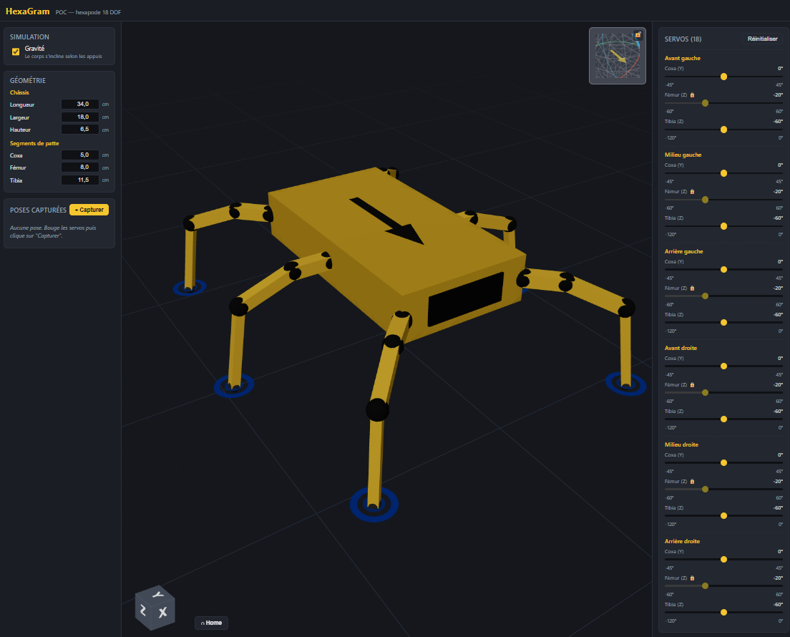

# HexaGram

Application web 3D pour visualiser, manipuler et programmer un hexapode robotique à
18 degrés de liberté. Destinée à terme à devenir un outil complet de conception et
de pilotage : visualisation paramétrique du squelette mécanique, édition de séquences
de mouvements, et communication sans-fil avec la carte de contrôle du robot.

> Statut : POC visuelle étendue, avec persistance serveur et comptes utilisateur.
> La géométrie et la cinématique correspondent au robot physique réel ; la couche de
> communication avec le matériel n'est pas encore implémentée.



---

## Le contexte

Ce dépôt accompagne un projet personnel : un hexapode jaune, châssis MDF découpé
laser, **6 pattes × 3 servomoteurs = 18 DOF**, conçu autour d'une carte Arduino
(architecture matérielle non finalisée). À terme, la carte sera complétée d'un
module sans-fil (BLE ou WiFi) pour permettre le pilotage depuis une tablette
indépendamment d'un PC.

Le besoin initial est de pouvoir **manipuler le robot virtuellement** avant tout
chargement de mouvements dans la machine réelle : positionner les pattes une à une,
capturer des poses, enchaîner les poses en séquences de marche / mouvement, puis
exporter ces séquences vers le robot. L'application doit fonctionner indifféremment
sur PC Windows et sur tablette, d'où le choix d'une stack web.

### Spécifications du robot physique

| Élément | Valeur mesurée |
|---|---|
| Châssis | 34 cm (longueur) × 18 cm (largeur) × 6.5 cm (hauteur) |
| Segment **coxa** (axe-à-axe) | 5.0 cm |
| Segment **fémur** | 8.0 cm |
| Segment **tibia** | 11.5 cm |
| Pattes | 6, disposées en étoile (3 par côté long) |
| Servos par patte | 3 (coxa = lacet vertical, fémur = tangage, tibia = genou) |

### Architecture cinématique d'une patte

1. **Coxa** — servo monté à plat sur le châssis, axe **vertical** → fait pivoter
   la patte horizontalement (sweep avant/arrière)
2. **Fémur** — axe **horizontal perpendiculaire à la patte** → lève et abaisse
3. **Tibia** — articulé en bout de fémur, axe horizontal → flexion du genou
4. **Pied** — embout caoutchouc au bout du tibia

---

## Vision de l'interface

L'interface se construit autour de **trois zones principales** :

- **Espace 3D central** — vue orbitable de l'hexapode avec sol de référence,
  marqueurs d'orientation et de contact. Reflète en temps réel chaque modification.
- **Panneau gauche** — profil robot actif, géométrie ajustable, centre de gravité,
  options de simulation, gestion des poses capturées.
- **Panneau droit** — contrôle individuel des 18 servomoteurs avec respect des
  limites mécaniques.

S'ajoutent des **overlays** sur la zone 3D : boussole avec indicateurs de
niveau à bulle (pitch/roll), gizmo cube d'orientation, bouton de retour à la vue
par défaut.

### Fonctionnalités attendues à terme

| Domaine | Cible |
|---|---|
| Visualisation | Vue 3D paramétrique avec orbit/zoom/pan, gravité simulée |
| Contrôle direct | Slider par servomoteur avec limites configurables, poses en JSON |
| Séquençage | Timeline éditable de poses avec interpolation, lecture animée, export |
| Cinématique inverse | Manipulation directe du bout d'une patte en 3D |
| Communication robot | Web Serial (USB/PC), BLE/WiFi (tablette), protocole Arduino |
| Bibliothèque | Templates de poses et séquences courantes |

---

## État actuel

### Ce qui fonctionne

#### Modèle 3D et simulation

- Squelette paramétrique : châssis + 6 pattes × 3 segments, géométrie ajustable
  en cm depuis l'UI (valeurs par défaut = mesures réelles du robot).
- 18 sliders servo avec limites min/max par servo.
- **Simulation de gravité** : ajustement de plan par moindres carrés sur les appuis,
  inclinaison du châssis en temps réel, marqueurs de contact au sol.
- **Mode miroir** : lie les pattes symétriques gauche/droite (coxa en opposition,
  fémur/tibia identiques).
- **Corps transparent** : bascule châssis opaque ↔ transparent pour voir le CoG.

#### Centre de gravité (CoG)

- Marqueur déplaçable en **drag 3D** depuis la zone de sol : mouvements horizontaux
  (X/Z) suivent la direction caméra, mouvement vertical (Y) lève/abaisse la boule rouge.
- **Verrous d'axe X/Y/Z** avec cadenas cliquables dans le panneau.
- **Snap magnétique à 5 mm** avec aimant renforcé sur les axes (zéro).
- Contrainte : le CoG ne peut pas descendre sous le sol.
- Polygone d'appui affiché ; indicateur stable (vert) / instable (rouge).
- Réinitialisation en un clic.

#### Boussole et overlays

- Boussole 3D en overlay haut-droite : sphère avec 3 anneaux colorés et flèche
  d'orientation extrudée en 3D, synchronisée avec la vue principale.
- **Indicateurs de niveau à bulle** (pitch/roll) sur les côtés de la boussole :
  bulle colorée (vert/orange/rouge) selon l'inclinaison.
- Verrou cliquable pour figer la boussole.
- Gizmo cube en overlay bas-gauche.
- Bouton **Home** pour revenir à la vue initiale.

#### Capture de poses

- Snapshot des 18 angles, restauration en un clic, export JSON.

#### Comptes et profils robot

- Inscription / connexion avec JWT (persisté en localStorage).
- **Profils robot** sauvegardés côté serveur : géométrie complète, keyframes,
  options (miroir, gravité, transparence, verrous CoG).
- Sélecteur de profil dans le panneau gauche ; auto-chargement du dernier profil
  modifié à la connexion.
- Sauvegarde en un clic : crée un nouveau profil (modal de nommage) ou écrase
  le profil existant.

#### Persistance locale

- Cases à cocher (miroir, gravité, transparence) sauvegardées dans localStorage,
  restaurées au rechargement.
- Position et cible de la caméra sauvegardées et restaurées.
- **Notifications toast** (3 s) à chaque enregistrement de préférences ou de profil.

#### Cinématique inverse (IK)

- **Drag du pied en 3D** : cliquer sur la sphère de bout de tibia et glisser pour
  déplacer le pied dans l'espace caméra (haut/bas/gauche/droite).
- Solveur IK analytique (configuration elbow-up) : calcule coxa, fémur et tibia
  depuis la position cible en temps réel.
- **Contrainte sol** : le pied ne peut pas descendre sous y = 0.
- Contrainte de portée : si la cible est hors de portée des segments, le pied est
  ramené au point le plus proche dans la direction demandée.
- Les angles servo sont automatiquement bridés aux limites ±90°.
- **Caméra figée** pendant le drag (OrbitControls désactivés).
- Retour visuel : sphère jaune au survol, verte pendant le drag.

### Ce qui n'est pas encore fait

- **Séquenceur** : timeline avec durées par keyframe, interpolation, lecture animée.
- **Limites servo réelles** : actuellement valeurs génériques, à remplacer par les
  plages mécaniques mesurées sur le robot.
- **Communication avec le robot** : abstraction transport + Web Serial / BLE / WiFi,
  protocole Arduino.
- **Bibliothèque de poses/séquences** prédéfinies.
- **Packaging** en application Windows (Tauri) ou PWA tablette.

---

## Stack technique

| Couche | Choix |
|---|---|
| Build | Vite + TypeScript |
| UI | React 18 |
| 3D | Three.js via [`@react-three/fiber`](https://github.com/pmndrs/react-three-fiber) et [`@react-three/drei`](https://github.com/pmndrs/drei) |
| State | [Zustand](https://github.com/pmndrs/zustand) |
| Backend | Node.js + Express + SQLite (JWT, profils robot) |
| Déploiement | VM Freebox Ultra — Caddy static file server, port 6503, LAN only |
| Packaging desktop futur | Tauri (binaire Windows léger) |
| Packaging tablette futur | PWA installable |
| Comm robot future | Web Serial API (Chrome/Edge desktop), Web Bluetooth ou WebSocket (tablette) |

### Organisation du code

```
src/
├── model/              Géométrie, servos, cinématique (TypeScript pur)
│   ├── hexapod.ts          Dimensions, ancrages, table des 18 servos
│   ├── servo.ts            Définition d'un servo, helpers d'angle
│   ├── pose.ts             Type Pose (18 angles), keyframes
│   └── kinematics.ts       Forward kinematics, plan d'appui, transform corps
├── three/              Composants 3D React-Three-Fiber
│   ├── Scene.tsx           Canvas principal, lumières, grille, persistence caméra
│   ├── Hexapod.tsx         Châssis, flèches d'orientation, lift gravité
│   ├── Leg.tsx             Patte articulée (3 segments)
│   ├── ContactMarkers.tsx  Marqueurs de contact + CoG drag handle
│   └── Compass.tsx         Boussole 3D + indicateurs pitch/roll
├── ui/                 Panneaux HTML
│   ├── ProfilePanel.tsx    Sélecteur de profil robot + sauvegarde
│   ├── SimulationPanel.tsx Toggles gravité / transparence + copie état
│   ├── GeometryPanel.tsx   Saisie dimensions + centre de gravité
│   ├── ServoPanel.tsx      Sliders + verrouillage gravité
│   ├── MirrorPanel.tsx     Toggle mode miroir
│   ├── PoseList.tsx        Capture / restauration des poses
│   ├── AuthModal.tsx       Modal inscription / connexion
│   ├── UserButton.tsx      Bouton utilisateur connecté
│   ├── Modal.tsx           Composant modal générique
│   └── Toast.tsx           Notification toast 3 secondes
├── store/              État global Zustand
│   ├── useHexapodStore.ts   Pose, géométrie, CoG, options, sérialisation profil
│   ├── useBodyTransform.ts  Hook : position/rotation corps + polygone d'appui
│   ├── useProfilesStore.ts  CRUD profils robot (API serveur)
│   ├── useAuthStore.ts      Authentification JWT
│   └── useToastStore.ts     Notifications toast
├── api/
│   └── client.ts           Client HTTP (fetch + JWT)
├── App.tsx             Layout général + bootstrap auth + auto-chargement profil
└── main.tsx            Bootstrap React
```

---

## Lancement local

Prérequis : Node.js ≥ 18.

```bash
# Frontend
npm install
npm run dev
```

```bash
# Backend (dans /server)
cd server
npm install
npm run dev
```

Puis ouvrir `http://localhost:5173/`.

Pour accéder depuis une tablette du même réseau : Vite affiche une URL réseau
(`http://<ip>:5173/`) au démarrage.

### Type-check et build

```bash
npm run build      # type-check + build production
npm run preview    # serveur statique pour tester la build
```

### Déploiement (LAN)

```powershell
pwsh -File deploy/deploy.ps1
```

Build Vite + backend, tar, SCP vers la VM Freebox, reload Caddy — disponible sur
`http://192.168.1.141:6503`.

---

## Roadmap

| Phase | Description | Statut |
|---|---|---|
| 0 | Setup projet (Vite + TS + R3F + Zustand) | ✅ |
| 1 | POC visuel : modèle 3D, sliders, gravité, capture de poses | ✅ |
| 1b | Profils robot, comptes utilisateur, CoG drag, persistance | ✅ |
| 2 | Séquenceur : timeline, interpolation, lecture animée, persistance | 🔜 |
| 3 | Cinématique inverse (manipulation directe en 3D) | ✅ |
| 4 | Communication robot (Web Serial / BLE / WiFi) | 🔜 |
| 5 | Packaging Tauri (Windows) + PWA (tablette) | 🔜 |

---

## Licence

Projet personnel — pas de licence publiée à ce stade.
